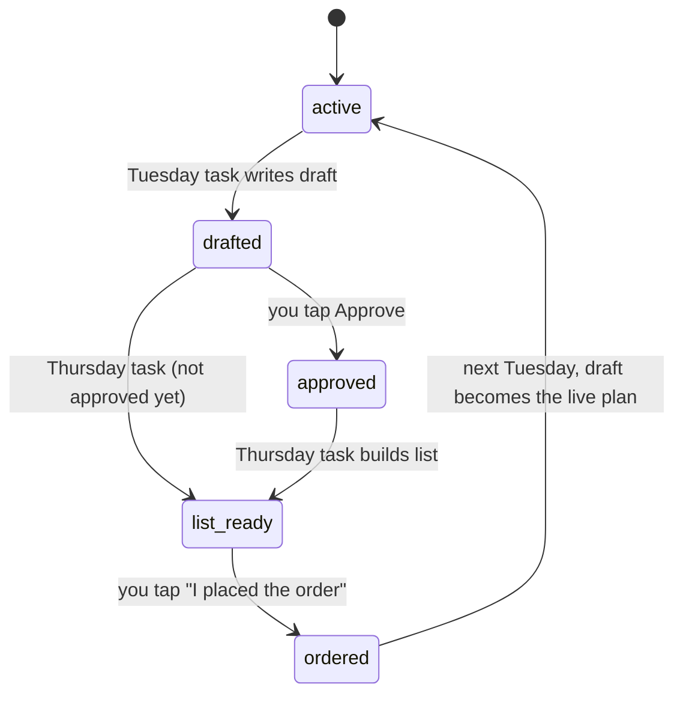

# Data model

The board keeps everything in its artifact database: JSON documents grouped into collections. The page, the scheduled tasks, and you (through Claude) all read and write the same documents. Dates are local `YYYY-MM-DD` strings.

## Collections

### `meals`: the live two-week plan
One document per night.

| Field | Type | Notes |
|---|---|---|
| `date` | string | `2026-10-05` |
| `kind` | `"cook"` \| `"leftovers"` \| `"flex"` | Drives the colored chip and the "cook night 2 of 3" count |
| `title` | string | "Chicken fajitas" |
| `details` | string | One line under the title |
| `recipe` | object | `{serves, time, oven?, ingredients: [], steps: [], tip}` |
| `from` | string | Leftover nights only: the id of the cook meal, which links to its recipe |
| `thaw` | string | Optional. What to move from freezer to fridge **the night before**, e.g. "the chicken breast (about 2 lb)" |
| `thawDone` | bool | Set when someone taps "Done, it's in the fridge" |
| `rating` | 0–5 | Set from the stars |
| `swapOut` | bool | Draft meals only: "Replace this meal" |

### `draft`
The proposed next plan, in the same shape as `meals`. The Tuesday task writes it, you review it, and it becomes `meals` once it starts.

### `history`
Past meals, kept so ratings add up across plans.

### `notes`
`{meal: <meal id>, text, at}`, for example "try with angel hair next time."

### `ideas`
`{text, at}`: requests for the next plan, like "more fish" or "busy week of the 20th."

### `grocery`
`{text, at}`: quick additions for the next order.

### `staples`
`{name, group, status, order}`. `status` is `"have"`, `"low"`, or `"unknown"`. "Low" adds the item to the next order.

### `freezer`
`{name, forMeal, at}`: what's in the freezer and what it's for.

### `plan` (two documents)

**`plan/current`**

| Field | Notes |
|---|---|
| `start`, `end` | Range of the live plan |
| `guidelines` | Household food rules, which the planner reads every time |
| `status` | `active` → `drafted` → `approved` → `list_ready` → `ordered` |
| `pickup` | e.g. "Sun Oct 11, afternoon" |
| `statusNote` | One-line note shown in the banner, e.g. "38 items. Not approved yet." |

**`plan/draft`**

| Field | Notes |
|---|---|
| `start`, `end`, `pickup` | The next plan's range and pickup |
| `summary` | What's new and what's returning |
| `prep` | "Freeze on arrival: …" |
| `groceries` | `[{section, items: []}]` |
| `orderText` | The final paste-ready list, written Thursday |
| `orderDocUrl` | Link to the Google Doc copy |
| `included` | `{grocery: [ids], staples: [ids]}`, cleared when you tap "I placed the order" |

## Status flow

